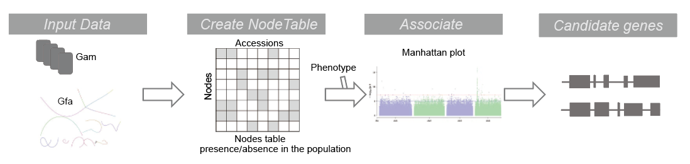

## NodeGWAS Workflow

### Overview


### <span id="installation">Installation</span>

```bash
git clone git@github.com:zhangyixing3/NodeGWAS.git
cd NodeGWAS && cargo build --release
```
The binary file `nodegwas` will be located in the `NodeGWAS/target/release` directory.

### 1. Input Data

The workflow begins with the following input data:

```bash
(vg filter input_gam/AH1803.gam -r 0.90 -fu -m 1 -q 15 -D 999 -t 2 -x Srufi.combined.giraffe.xg |
vg view -aM - | nodegwas count -n input_gam/AH1803.filter.node) 1>AH1803.filter.node.log 2>&1
```
- **AH1803.gam**: VG graph alignment format.
- **Srufi.combined.giraffe.xg**: The graph pangenome.
- The output file **AH1803.filter.node.gz** records the occurrence count of each node.

### 2. Create Nodetable

Next, extract alignment information from each sample and compile it into a table indicating the presence or absence of nodes.

- **Accessions**: Accessions or samples in the study.
- **Nodes**: Nodes within the graph pangenome.

```bash
nodegwas rmerge -i sample.list -o node_table -n 2 -t
```

Sample list format:
```
../nodes/10020.gam.filter.node.gz	10020
../nodes/10022.gam.filter.node.gz	10022
../nodes/10023.gam.filter.node.gz	10023
../nodes/1002.gam.filter.node.gz	1002
../nodes/1061.gam.filter.node.gz	1061
../nodes/1062.gam.filter.node.gz	1062
```
**Note**: The first column is the file path, and the second column is the sample ID in the output. The output file will be `node_table2.gz`. If `-t` is used, the node table will contain only two values (0, 1).

### 3. split vcf file by chromosome and perform pca and kinship analysis
1. **EMMAX**: Since the number of nodes must be less than 20,000,000, GWAS is performed by chromosome.

```bash
# Extract nodes from the graph pangenome
nodegwas extract -g Srufi.combined.giraffe.gfa -n w.n.node
# Convert the node table to VCF format and split by chromosome
nodegwas tovcf -k nodegwas2.gz -n w.p.node
```
Output files:
```
1_vcf  2_vcf  3_vcf  4_vcf  5_vcf  6_vcf  7_vcf  8_vcf  9_vcf 10_vcf merged_vcf
```

2. merge mutiple vcf files into one file and perform pca and kinship analysis.
```bash
for i in *vcf;do bgzip $i;done
python ./merge_vcf.py  1_vcf.gz  2_vcf.gz  3_vcf.gz  4_vcf.gz  5_vcf.gz  6_vcf.gz  7_vcf.gz  8_vcf.gz  9_vcf.gz 10_vcf.gz   -o merge.vcf
bgzip merge.vcf
# vcf convert to tped
plink --vcf merge.vcf.gz  --recode 12 transpose --out emmax_in --maf 0.05 --geno 0.1   --allow-extra-chr --threads 10 --id-delim + --double-id
# tped convert to bed
plink --tfile emmax_in  --make-bed --out emmax_in  --allow-extra-chr --threads 10 --id-delim + --double-id
# pca
plink  -bfile emmax_in --pca 10 --out merge_vcf2bed_PCA   --allow-extra-chr --threads 10 --id-delim + --double-id
awk 'BEGIN{OFS="\t"}{print $1,$2,1,$3,$4,$5,$6,$7,$8,$9,$10,$11,$12}' merge_vcf2bed_PCA.eigenvec  > pca
# kinship matrix
emmax-kin-intel64 emmax_in -v -d 10 -o kinship
```
### 4. Perform GWAS analysis using EMMAX

```bash
# create directory for each chromosome
mkdir 1 2 3  4 5 6 7 8 9 10
# move vcf files to each directory
for i in {1..10}; do mv "${i}_vcf.gz" "${i}";done
cd 1
# vcf to tped
plink --vcf 1_vcf.gz  --recode 12 transpose --out emmax_in --maf 0.05 --geno 0.1   --allow-extra-chr --threads 10 --id-delim + --double-id
# tped to bed
plink --tfile emmax_in  --make-bed --out emmax_in  --allow-extra-chr --threads 10 --id-delim + --double-id
# run emmax
emmax-intel64 -t emmax_in -o GZZTF.kinship.pca.output -p ../GZZTF.trait.order -k ../kinship -c ../pca
cd 2
  ...
cd 3
  ...
```
- Conduct GWAS analysis to identify associations between nodes and the phenotype of interest.
- Generate a Manhattan plot to visualize the significance of these associations.
