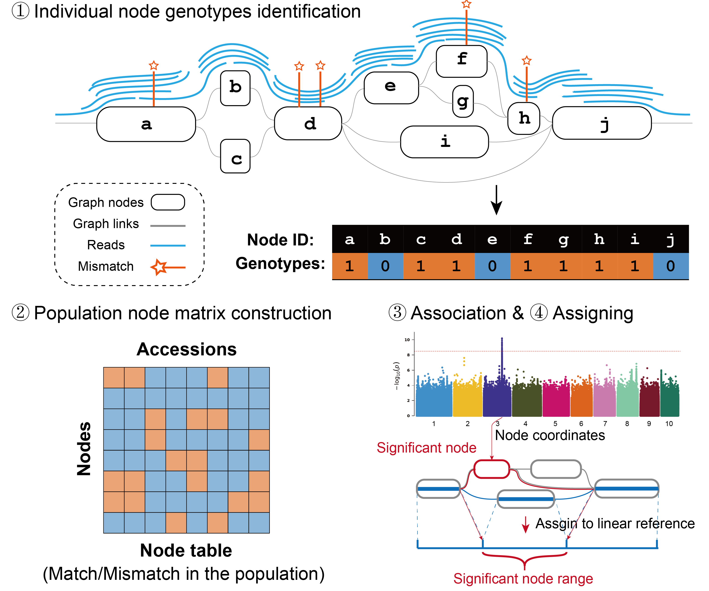

## NodeGWAS Workflow

### Overview


### <span id="installation">Installation</span>

```bash
git clone git@github.com:zhangyixing3/NodeGWAS.git
cd NodeGWAS && cargo build --release
```
The binary file `nodegwas` will be located in the `NodeGWAS/target/release` directory.

### 1. Prepare Graph Pangenome
Use `minigraph-cactus` or `pggb` pipeline to construct the graph pangenome
Chop the graph to reduce node length.
```bash
vg mod -X  32    97samples.full.vg    >  97samples.full.chop.32.vg
vg convert -f 97samples.full.chop.32.vg   > 97samples.full.chop.32.gfa
```
Create d10 graph and build giraffe index
```bash
vg clip 97samples.full.chop.32.vg -d 10 -P 035_Col_CEN_v12 -m 1000 | \
    vg clip -d 1 - -P 035_Col_CEN_v12 | \
    vg clip -sS - -P 035_Col_CEN_v12 > 97samples.full.chop.32.d10.vg
vg convert -f 97samples.full.chop.32.d10.vg  > 97samples.full.chop.32.d10.gfa
vg  autoindex -p mapping.d5 -g 97samples.full.chop.32.d10.gfa -w giraffe -t 40 -M 600G
```
Mapping resequencing data using `vg giraffe`
```bash
vg giraffe -t 10 -p -Z 97samples.full.chop.32.d10.giraffe.gbz -m 97samples.full.chop.32.d10.min -d 97samples.full.chop.32.d10.dist  \
    -f ../clean/1803_1.fq.gz  -f ../clean/1803_2.fq.gz \
    1>1803.gam 2>1803.gam.log
```
- **1803.gam**: Graph pangenome alignment format.

Convert GAM to nodes counts
```bash
(vg filter 1803.gam -r 0.90 -fu -m 1 -q 15 -D 999 -t 2 -x \
    97samples.full.chop.32.d10.xg |
    vg view -aM - | nodegwas count -n 1803.filter.node) 1>AH1803.filter.node.log 2>&1
```
### 2. Create Nodetable

Combine node counts from each sample
```bash
nodegwas rmerge -i sample.list -o node_table -n 2 -t
```

sample.list format:
```
../nodes/10020.gam.filter.node.gz	10020
../nodes/10022.gam.filter.node.gz	10022
../nodes/10023.gam.filter.node.gz	10023
../nodes/1002.gam.filter.node.gz	1002
../nodes/1061.gam.filter.node.gz	1061
../nodes/1062.gam.filter.node.gz	1062
```
**Column 1**: File path to node count.
**Column 2**: Sample ID.
### 3. Perform GWAS 
```bash
#  Convert Nodetable to VCF
nodegwas tovcf -k nodegwas2.gz
# vcf to tped
plink --vcf nodegwas2.vcf.gz  --recode 12 transpose --out emmax_in --maf 0.05 --geno 0.1   --allow-extra-chr --threads 10 --id-delim + --double-id
# tped to bed
plink --tfile emmax_in  --make-bed --out emmax_in  --allow-extra-chr --threads 10 --id-delim + --double-id
# kinship matrix
gemma  -bfile emmax_in  -gk 2 -p  FT10.order.1
# GWAS analysis using gemma
gemma    -bfile emmax_in   -k output/result.sXX.txt -lmm 2  -p  FT10.order.1
```

Return to Linear Genome Coordinates
```bash
nodegwas  rliftover -g  97samples.full.chop.gfa  -f 035 -o 97samples.full.chop
```
**97samples.full.chop.bubble.positions**: Bubble structures in linear coordinates
**97samples.full.chop.non_ref.node.positions**: Non-reference node positions
**035.node.positions**:  Cumulative offsets of nodes in the reference

```bash
awk '$10<0.01{print $2,$1,$3,$10}' result.assoc.txt  > result.assoc.txt.finally.filter
python ./node_position.py   result.assoc.txt.finally.filter full_97.non_ref.node.positions 035.node.positions   > result.assoc.txt.finally.filter.position
```
Example Output
```bash
head result.assoc.txt.finally.filter.position
chrsome	start	end	node_id	pvalue
1	3956	4460	5126	4.131444e-03
1	4465	4466	5410	7.229633e-03
1	4465	4466	5411	4.894490e-03
1	4465	4466	5415	3.666478e-03
1	4465	4466	5416	3.060831e-03
```


